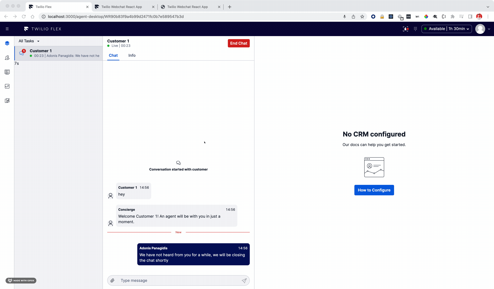
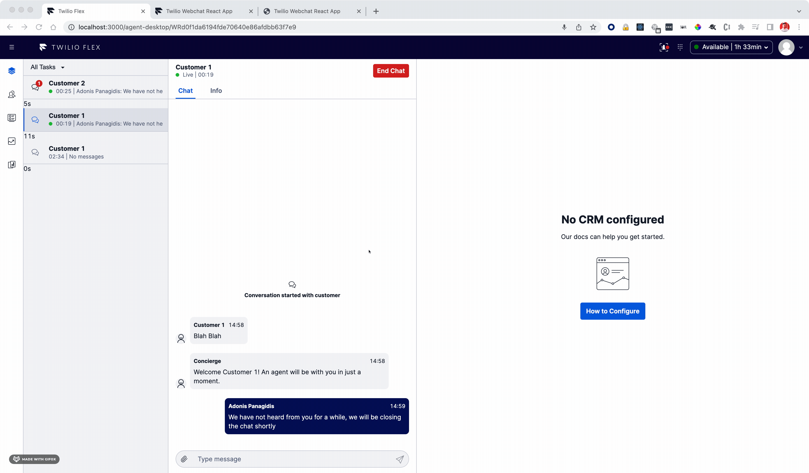

# Flex Conversations Inactivity plugin

>Twilio Flex Plugins allow you to customize the appearance and behavior of [Twilio Flex](https://www.twilio.com/flex). If you want to learn more about the capabilities and how to use the API, check out our [Flex documentation](https://www.twilio.com/docs/flex).

# Overview

This plugin addresses a common contact center need, to identify and react to stale conversations. The plugin keeps track of each ongoing conversation using a timer. Every time that a new customer message arrives, the timer of the respective conversation is reset. 

Features:
* When the timer reaches 0, the conversation is moved to "wrap up". 
* When the timer reaches a threshold, a warning message is sent to the customer informing them that the conversation is about to be concluded. The threshold and the warning message are configurable.
* Refreshing the browser does not reset the timers. If a customer message is received while the agent refreshes the browser, the timer is reset. 
 
# Demos






## Flex Plugin

This repository is a Flex plugin with some other assets. The following describes how you setup, develop and deploy your Flex plugin.

### Requirements

To use Conversations in Flex a Flex2.0 account is required. If you are using Flex1.x see this guide to migrate to Flex 2.0 
https://www.twilio.com/docs/flex/developer/plugins/migration-guide

This plugin uses the Twilio CLI for deployment and development.

- Install or update the Twilio CLI to the latest version
  - Instructions: https://www.twilio.com/docs/twilio-cli/quickstart#install-twilio-cli
- Install or update the Flex CLI Plugin to the latest version

  - Instructions: https://www.twilio.com/docs/flex/developer/plugins/cli/install

- Install the Twilio Serverless plugin.
  - Instructions: https://www.twilio.com/docs/twilio-cli/plugins#available-plugins

### Development

In order to develop locally, you can use the Twilio CLI to run the plugin locally. Using your commandline run the following from the root dirctory of the plugin.

```bash
twilio flex:plugins:start
```

This will automatically start up the Webpack Dev Server and open the browser for you. Your app will run on `http://localhost:3000`.

When you make changes to your code, the browser window will be automatically refreshed.

---

### Deploy

#### Plugin Deployment

Once you are happy with your plugin, you have to deploy then release the plugin for it to take affecte on Twilio hosted Flex.

Run the following command to start the deployment:

```bash
twilio flex:plugins:deploy --major --changelog "Notes for this version" --description "Functionality of the plugin"
```

After your deployment runs you will receive instructions for releasing your plugin from the bash prompt. You can use this or skip this step and release your plugin from the Flex plugin dashboard here https://flex.twilio.com/admin/plugins

For more details on deploying your plugin, refer to the [deploying your plugin guide](https://www.twilio.com/docs/flex/plugins#deploying-your-plugin).

Note: Common packages like `React`, `ReactDOM`, `Redux` and `ReactRedux` are not bundled with the build because they are treated as external dependencies so the plugin will depend on Flex to provide them globally.